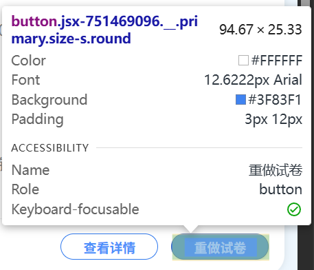
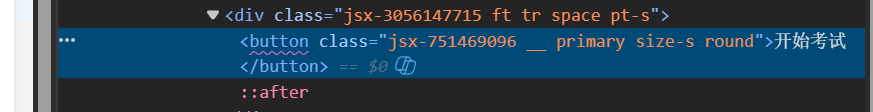
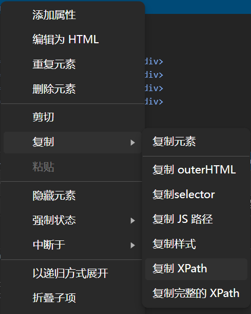
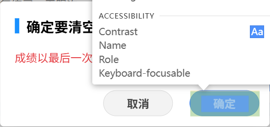
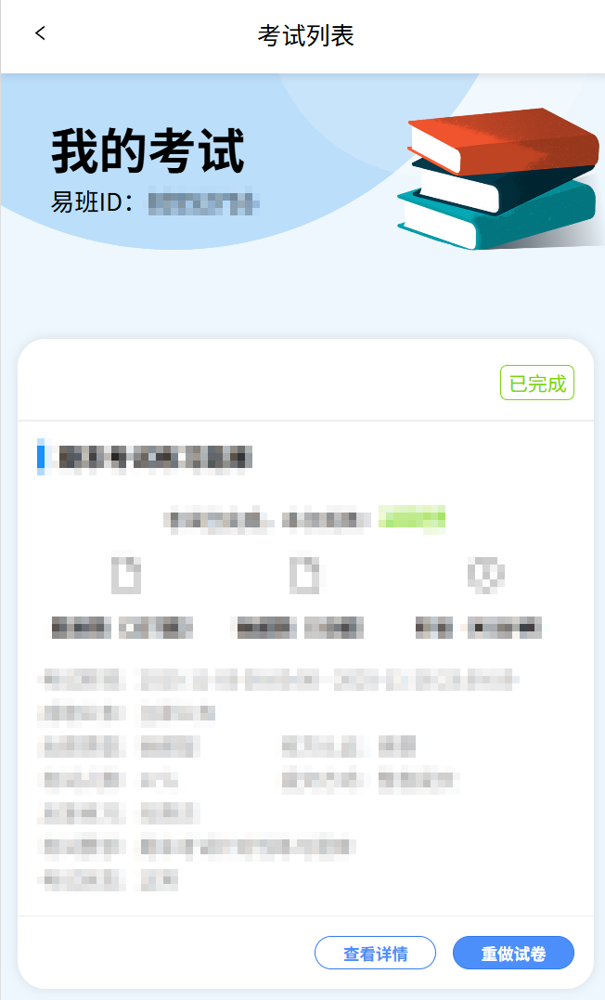
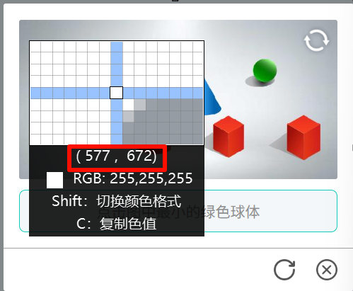
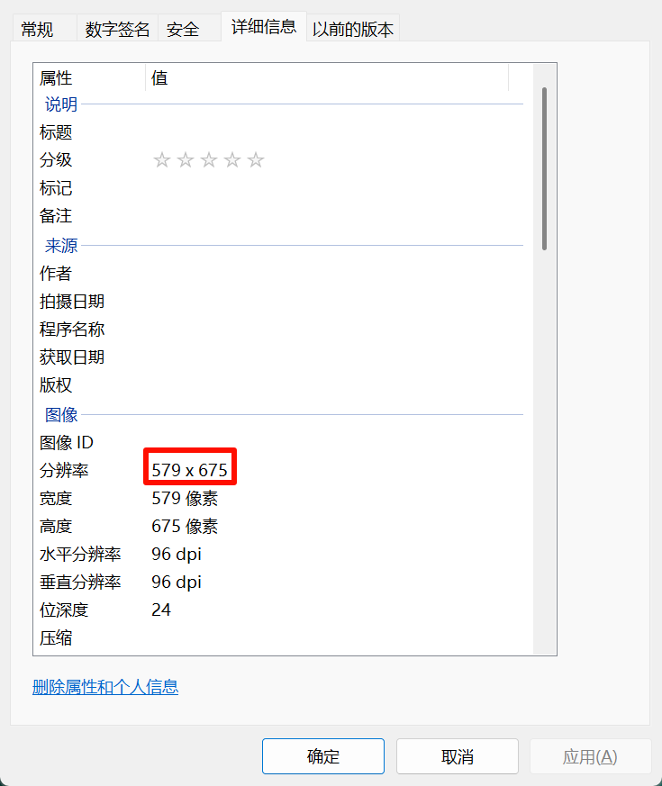

# **免责声明**

- 本项目仅供学习交流，请勿挪作他用
- 使用本项目所存在的风险后果完全由本人承担
---
# 使用方法

### 一、部署
1. 本项目使用Microsoft Edge浏览器，如果未安装，请前往[下载](https://www.microsoft.com/zh-cn/edge/download)。
2. 安装[Microsoft Edge WebDriver](https://developer.microsoft.com/zh-cn/microsoft-edge/tools/webdriver)选择最新稳定版即可。
	1. 选择合适位置解压。
	2. 进入文件夹选中并右键<u>msedgedriver.exe</u>点击<u>复制文件地址</u>。
	3. Windows搜索<u>环境变量</u>并进入，选中上方用户环境变量的<u>PATH</u>条目点击编辑按钮进入，将上一步复制的地址粘贴到空白新条目中，***注意删除引号***，点击三个已经打开窗口的确定完成配置。
---
### 二、使用

1. <u>打开网页</u>右侧输入框输入题库文件名，使用<u>.json</u>后缀，文件不存在会自动新建（不建议手动创建，防止出现编码错误）。「使用过程中可动态更换题库」

2. 点击<u>打开网页</u>进入登录界面。

	* 启用<u>自动登录</u>等待进入即可，若控制台输出<u>Cookies失效</u>可尝试关闭程序等待片刻后重新启动（可能为网络问题导致登陆失败）如多次尝试失败请手动登录后在控制台任意输入以更新Cookies。「首次启动请手动登录」
	* 未启用<u>自动登录</u>请手动登录后在控制台任意输入以继续。
	* 未完成登录时窗口可能未响应。
	
3. 由于优课考试首次答题为<u>开始考试</u>按钮与已经做过的考试<u>重做试卷</u>按钮不同，故首次启动请开启<u>首次启动</u>按钮，首次启动状态下仅运行一次且不计入循环次数。「若考试已经做过但希望执行一次请勿使用首次启动模式，请使用循环模式」

	* 首次启动请在此页面开始

4. 非首次启动模式下将根据循环次数进行循环做题，一个完整循环为<u>做题+录入答案</u>，若题库中不存在题目，则默认选A或填入空格，存在题目则根据题库答案作答。
	1. 循环模式需按以下步骤填入必要信息。
	2. 在浏览器中按<u>F12</u>选择并使用元素选择器（或直接使用快捷键<u>Ctrl+Shift+C</u>打开）选择<u>开始考试</u>按钮点击后在右侧代码栏中右键高亮代码，依次选择<u>复制</u>><u>复制XPath</u> ，然后粘贴至窗口下方两个输入框的上方输入框。
	3. 正常点击<u>重做试卷</u>后弹出二级确认，依照上一步步骤，将二级确认的<u>确定</u>按钮的XPath复制到窗口下方两个输入框的下方输入框，点<u>取消</u>关闭二级确认。
	4. 循环模式请在此页面开始

5. 验证码自动验证功能

    1. 未勾选<u>自动验证</u>则循环中遇到验证码将等待人工输入，验证完成后在控制台任意输入以继续运行。

    2. 若勾选<u>自动验证</u>则需按以下步骤进行必要设置。

    3. 首次运行后会在程序同级目录中生成配置文件<u>config.ini</u>右键选择<u>在记事本中编辑</u>，在<u>system zoom</u>条目填写Windows系统缩放，如有多显示器请注意填写浏览器所在屏幕的缩放。

    4. 自行进入任意考试至验证码界面，使用第三方截图工具获取验证码图片左上角像素坐标，例如或使用Windows截图工具（<u>Win+Shift+S</u>）从主屏幕最左上角截至验证码图片左上角，保存图片后在属性页查看分辨率，然后将坐标填入配置文件<u>verification_position_x</u>和<u>verification_position_y</u>条目。「建议使用Windows窗口停靠、全屏等方法固定浏览器窗口位置后再录入坐标，便于后续使用。若移动窗口请勿忘记更新坐标」

    5. 开启自动验证后运行过程中建议不要使用鼠标，防止验证码点击失败。

---

### 三、注意事项

* 本项目题库使用「题目为键，答案列表为值」的json数据格式，未提供格式转换功能，请自行转换。
* 如正确操作无法使用，可能为优课更新造成。
* 目前为测试版，可能存在诸多问题。